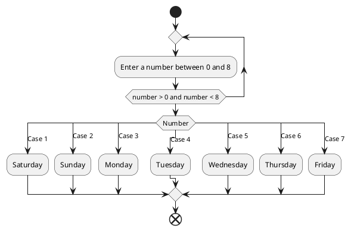
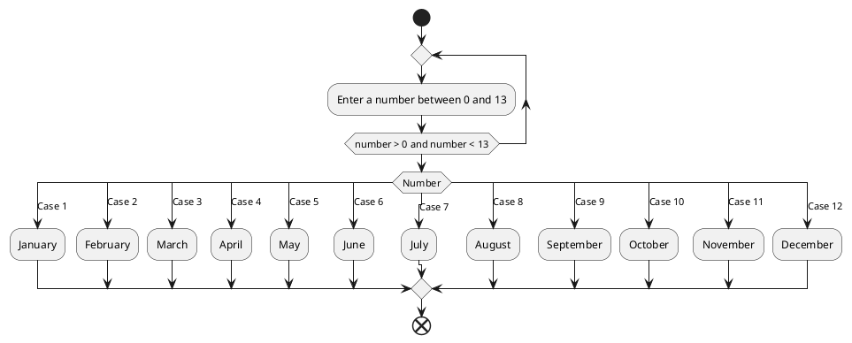

# 38


![[Screenshot_20250912_141935.jpg]]

```plantuml 


start

:Read N;

if (N > 0?) then (No)
  :Print "Number must be > 0";
  end
else (Yes)
  :Counter = 2;
  :M = Round(N / 2);

  repeat
    if (N % Counter = 0?) then (Yes)
      :Print "Not Prime";
      end
    else (No)
      if (Counter = M?) then (Yes)
        :Print "Prime";
        end
      else (No)
        :Counter = Counter + 1;
      endif
    endif
  repeat while (Counter < N)
endif


end
```


![[ROzFQyCm3CNl-XIFmg1XXsqzDljJsBbXzBPZIbGQY9DYo-phJuenej1tyPEHVdew9EcZv33HghKYsf-u7z2rHEC5smwVUFrg85UUjLeQ0lO_SPm5cow7CqU4d0Hdji...lMwgEwa_uDod_1hj5bGEGRzq9GbSrFy3dFK9Wc3x88r0Qs_QQImKp9KN9NibEFZwZElMSwzG7txiZgdl5MXtaUnWkvg-VYxpfEx9dUqJLKMiXUCXtKv33z0m00.png]]


| c   | n   | m   | result              |
| --- | --- | --- | ------------------- |
| 2   | 4   | 2   | not a prime number  |
| -   | -   | -   |                     |
| 2   | 5   | 3   |                     |
| 3   | 5   | -   | its a prime number  |
|     |     |     |                     |
|     |     |     |                     |


# 39


```plantuml 
start

:Read total bill,cash paid;


:Print remainder = cash paid - total bill;


end
```


# 40


```plantuml 
start

:read billvalue;

:tax = billvalue * 0.16;

:fee = billvalue * 0.10;

:Print totalBill = billvalue + tax + fee;


end
```


# 41

```plantuml 
:read hours;

:Days = hours/24; 

:Weeks = Days / 7;

:Print Days,Weeks;

```

# 42

```plantuml 


start

:Read days ,hours ,minutes ,seconds;

:Time = 
days * 24 * 60 * 60 +
hours * 60 * 60 +
minutes * 60 +
seconds;


end
```


# 43

```plantuml 
start 

:Read seconds; 

: Floor(seconds / 24 / 60 / 60);


end
```
![[Screenshot_20250912_153809.jpg]]

```math-highlight 

seconds = 193535

days = floor(seconds / 24 / 60 / 60)

left_seconds =193535 - days * 24 * 60 * 60    

hours = floor(left_seconds / 60 / 60)

left_seconds2 =left_seconds - hours * 60 * 60    


minutes = floor(left_seconds2 / 60)

seconds =left_seconds2 - minutes * 60    


days 
hours
minutes 
seconds 

```


# 44




# 45





# 46

```plantuml 

start

:Counter = 64;

repeat 
:counter =counter + 1;
:Print Char(counter);

repeat while (counter < 90)


end

```


# 47


```plantuml 

start
 
:Read LoanAmount,MonthlyPayments;

:Time = LoanAmount / MonthlyPayments ;

: Print Time + "months" ;


end
 

```

# 48 

```plantuml 

start
 
:Read LoanAmount,Months;

:MonthlyPayments = LoanAmount / months ;

: Print MonthlyPayments + "each month" ;


end
 

```


# 49

```plantuml 

start
 
:Read Pin;

if (Pin = 1234) then (True)

: your balance is 7500;

else (False)

: Wrong Pin;

endif
end
 

```


# 50


```plantuml 

start

:counter = 0;


repeat 
:counter = counter + 1;
:Read Pin;

if (Pin = 1234) then (True)

: your balance is 7500;

else (False)

:Wrong Pin;


endif

if (counter = 3 and pin <> 1234) then (True)
:Card is locked;
end
endif


repeat while (Pin <> 1234 and counter < 4)


end

```

![[Screenshot_20250912_171656.jpg]]
